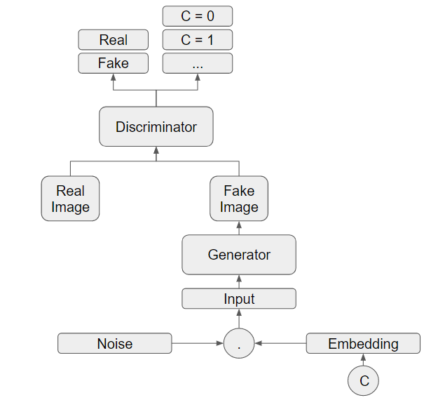

# Picto-GAN

This project is an attempt to design an online Pictionary playing system using Generative Adversarial Networks. 

This project uses data from Google's Quick, Draw! dataset to take in multiple pictionary card phrases as inputs and generate doodles for each phrase based on the class label. 

To run the code, download npy files for apple, banana, car, grapes, moon, spider, strawberry, sun, tree from [Google Quick Draw dataset](https://console.cloud.google.com/storage/browser/quickdraw_dataset/full/numpy_bitmap)
